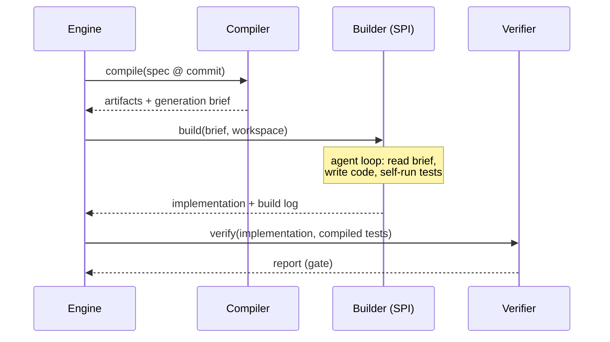

# Agent architecture

Agents are specforge's smallest plane by design. They own exactly two
responsibilities — writing transformation logic, and proposing evolution PRs — and
both are bounded by deterministic contracts on either side: a compiler-produced
brief going in, a verifier-enforced gate coming out.

## The builder SPI

One builder agent runs per build. Which one is a per-spec configuration choice
(`x-buildspec.agent`), not an architectural commitment
([ADR-0002](../adr/0002-single-pluggable-builder.md)).

**SPI contract:**

| | |
|---|---|
| **Input** | Generation brief; scratch workspace; scoped credentials (scratch schema only) |
| **Output** | Implementation files matching the target adapter's expected shape; structured build log (steps taken, decisions made, test iterations) |
| **Guarantees required of every builder** | Runs headless/unattended (CI-invokable); writes only inside the workspace and scratch schema; terminates (iteration budget); emits the build log even on failure |
| **Explicitly not the builder's job** | Deciding what "correct" means; deploying; touching production; modifying the spec |

**v1 implementations:**

- **`builders/claude_code/`** — Claude Code invoked headless via CLI. The builder
  directory is a Claude Code project: a `CLAUDE.md` encoding the build discipline
  (read brief → plan → implement → run acceptance tests → iterate until green or
  budget exhausted) plus target-specific skills (dbt conventions, Lakeflow
  Declarative Pipelines patterns).
- **`builders/genie_code/`** — Databricks Genie Code driven via workspace APIs, with
  the equivalent discipline packaged as Genie Code skills. Runs inside the workspace,
  which gives it native access to UC metadata the Claude Code builder gets via MCP.

Both encode the same protocol; the engine cannot tell them apart. That symmetry is
enforced by the SPI, and it is what makes an eventual side-by-side comparison (a
deliberate non-goal for v1) a feature flag rather than a redesign.

## Agent context via MCP

Builders need live context the brief can't fully carry — actual source schemas,
sample rows, existing UC assets. Rather than each builder implementing bespoke
Databricks access, specforge standardizes on **MCP servers** as the context layer:

- **`specforge-context` MCP server** — read-only tools: `get_brief`,
  `describe_source`, `sample_source`, `list_related_products`, `run_acceptance_tests`
  (against scratch). Any MCP-capable agent gets the same view of the world.
- Databricks' managed MCP surface (UC functions, Genie spaces) slots in where
  available; the specforge server is the portable minimum.

This is also the platform's own front door: **every engine capability
(`plan`, `apply`, `compile`, `verify`, `drift`) is exposed as an MCP tool**, so a
conversational agent — Claude in a chat, an IDE assistant, a Genie space — can drive
the whole lifecycle. The CLI and the MCP surface are two skins over the same engine.

## The evolution agent

The second agentic responsibility. Input: a reconciler drift report (see
[runtime.md](runtime.md)). Output: **a pull request** — never a direct change —
containing whichever of these the drift warrants:

| Drift class | Typical proposal |
|---|---|
| Source schema change broke the mapping | Updated transformation, same contract |
| Quality rule persistently failing | Fixed transformation, or a spec PR arguing the rule should change (human decides which truth is right) |
| SLA breach pattern | Ops-block change (schedule, compute profile) |
| Consumer-requested contract change | Spec minor/major version bump + regenerated implementation |

The evolution agent reuses the builder SPI — it's the same kind of actor with a
different trigger. GitOps is the safety model: the proposal is reviewable, revertable,
and inert until merged.

## Trust and audit model

- **Scoped identity.** Builders get a service principal with write access to a
  scratch schema and their workspace, nothing else. Production mutations flow only
  through the engine's deploy step.
- **Deterministic gate.** The verifier runs compiler-emitted tests. An agent claiming
  success is irrelevant; only the gate's report is.
- **Full flight recorder.** Every build persists: spec commit → brief → build log →
  diff → verification report → deploy record. When something goes wrong (or
  suspiciously right), the whole causal chain is inspectable.
- **Budgets.** Iteration and token budgets per build, enforced by the engine, so a
  stuck agent fails fast and loudly rather than expensively.
