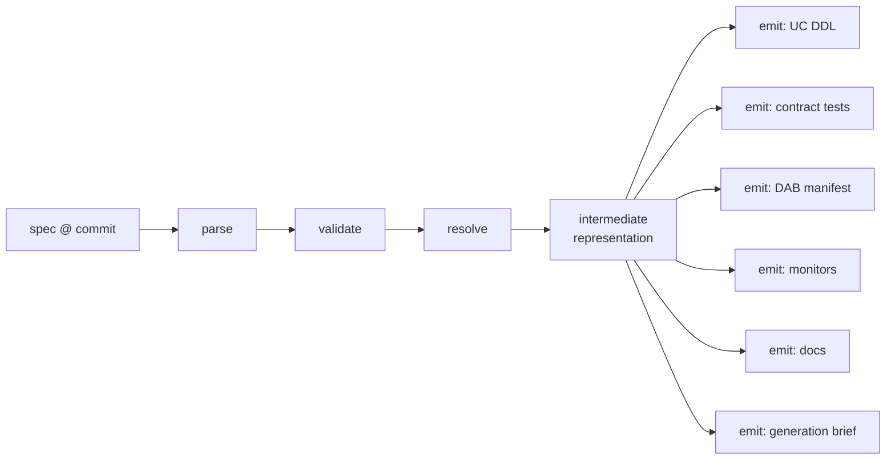

# Compiler architecture

The compiler is the deterministic heart of specforge. It consumes a spec at a pinned
git commit and emits every artifact that can be mechanically derived from it. It
contains no LLM calls. Same input, same output, every run — which is what makes
builds diffable, cacheable, and CI-testable.

## Pipeline



### 1. Parse
Read the ODCS YAML plus the `x-buildspec` extension block into a typed model. Reject
unknown top-level keys early — silence here becomes confusion downstream.

### 2. Validate
Three validation layers, in order:

1. **Schema validity** — is this well-formed ODCS + well-formed extension? (JSON
   Schema; runs in CI on every spec PR, no Databricks connection needed.)
2. **Semantic validity** — do the pieces cohere? Quality rules reference declared
   columns; the build target is compatible with the declared sources (a CDC source
   with `build_target: dbt` is an error); SLA declarations have the monitors they
   imply; every source is resolvable to a UC connection reference.
3. **Policy validity** — org-level rules, pluggable: naming conventions, mandatory
   ownership fields, required classifications on PII-tagged columns. This is the
   computational-governance hook: governance rules run at compile time, not as
   after-the-fact audits.

### 3. Resolve
Bind the abstract spec to a concrete environment: catalog/schema names per target
(dev/staging/prod), compute profile, connection references, and the resolved build
target if `build_target: auto` (via the routing rule table — see
[the DSL spec §5](../spec/dsl-specification.md)). Output of this stage is the
**resolved spec** — the exact document later published to Unity Catalog, so what
consumers see is what was actually deployed, not just what was authored.

### 4. Intermediate representation
A normalized, target-independent model of the product: entities, columns, constraints,
quality assertions, SLAs, source bindings. Emitters consume the IR, never the raw
YAML. This is what keeps adding a new target (or a new spec version) from rippling
through every emitter.

### 5. Emitters

| Emitter | Output | Notes |
|---|---|---|
| **catalog** | `CREATE TABLE` / comments / tags / grants DDL | Idempotent; applied via DAB, not directly |
| **tests** | Contract-test suite in the configured verifier's format | Quality block → assertions; schema block → conformance checks; required vs `warn` severity preserved |
| **bundle** | `databricks.yml` + resource fragments | Targets map to environments; permissions from ownership block |
| **monitors** | Lakehouse Monitoring configs | Freshness/volume/quality monitors from the SLA block |
| **docs** | Product page, column-level docs | Rendered from the spec — documentation can't drift from the contract because it *is* the contract |
| **derivations** | Calculated-column expressions compiled into the target's scaffold (dbt model / Lakeflow step) | From `transformation.derivations` ([ADR-0007](../adr/0007-derivations-vs-intent.md)); compiler-authored, agent builds around it and never rewrites it |
| **brief** | The generation brief (below) | The compiler's contract with the agent |

## The generation brief

The brief is the single interface between the deterministic world and the agent. It
is a self-contained instruction package:

```yaml
# .specforge/build/<product>/<commit>/brief.yaml   (illustrative)
product: orders_daily
spec_commit: 4f2a9c1
build_target: dbt
you_must_produce:
  - models/                    # transformation code mapping sources → contract
inputs:
  sources:                     # resolved source bindings with schemas, sampled stats
  target_schema:               # the contracted output schema, column by column
  semantics:                   # column descriptions, business definitions from the spec
acceptance:
  test_suite: tests/           # compiler-emitted; ALL required tests must pass
  forbidden:                   # e.g. no writes outside scratch schema; no schema drift
constraints:
  style: sql_first             # org conventions
  incremental: true
```

Design properties, each load-bearing:

- **The agent never reads the raw spec.** It reads the brief. This means spec-format
  evolution doesn't break builders, and the compiler can enrich the brief (sampled
  source statistics, resolved schemas) with context the raw spec doesn't carry.
- **Acceptance criteria travel with the task.** The agent knows exactly which tests it
  must pass before it starts — spec-driven TDD. It can run them locally in its loop,
  but the *gating* run is the verifier's, not the agent's.
- **The brief is an artifact.** Stored with the build log, it makes every agentic
  build reproducible-in-intent: you can always see precisely what the agent was asked
  to do, separate from what it did.

## Caching and incrementality

The compiler is a pure function of `(spec content, compiler version, environment
bindings)`, so outputs are content-addressable. `specforge plan` uses this to show
*only* what changes: edit a quality rule and the plan shows one test changing and
nothing else — the DDL, bundle, and brief hashes are identical, so generate/deploy
can be skipped for them. This is the property that makes frequent small spec
evolutions cheap.

## Failure philosophy

Compile failures are the *good* failures — they're deterministic, they happen before
any agent tokens or cluster time are spent, and they point at a line in the spec.
The validation layers are deliberately strict so that the expensive, fuzzy phases
(generate, verify-against-live-data) start from a spec that is already known to be
coherent. Push every error as early in the pipeline as it can possibly be detected.
