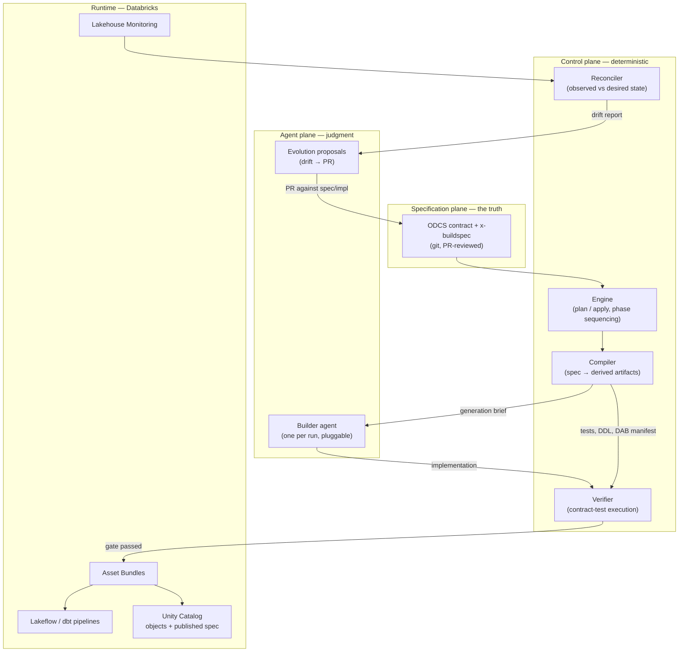
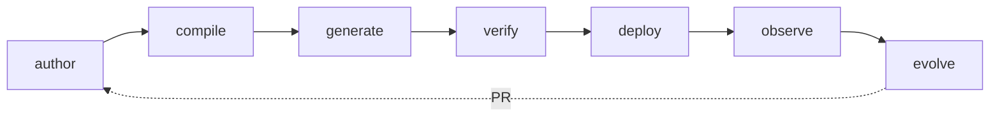
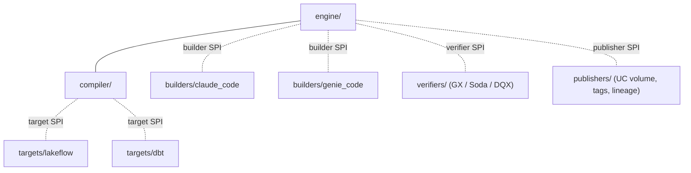

# Architecture overview

specforge is organized as **three planes** around a **seven-phase lifecycle**. The
guiding rule for every component placement: *determinism wherever possible, agents
only where judgment is required*.

## The three planes

**Specification plane.** The only place truth lives. ODCS contracts in git, one per
data product, authored and evolved through PRs. See
[the DSL specification](../spec/dsl-specification.md).

**Control plane.** Deterministic machinery. The engine sequences the lifecycle; the
compiler derives every mechanically derivable artifact; the verifier executes
contract tests; the reconciler compares live state to the spec. None of these
components contain an LLM call. Given the same inputs they produce the same outputs,
which is what makes the whole system auditable.

**Agent plane.** The deliberately small non-deterministic surface. One builder agent
per run writes transformation logic against a compiler-produced brief. The evolution
path turns reconciler drift reports into proposed PRs. Agents *propose*; the control
plane and humans *decide*.

## The lifecycle

| Phase | Owner | In | Out |
|---|---|---|---|
| **author** | Human (or agent-drafted, human-reviewed) | Requirements | Spec in git |
| **compile** | Compiler | Spec @ pinned commit | DDL, tests, DAB manifest, docs, generation brief |
| **generate** | Builder agent | Generation brief + repo context | Transformation code (Lakeflow / dbt) |
| **verify** | Verifier | Implementation + compiled tests | Pass/fail gate, verification report |
| **deploy** | Engine → DAB | Verified bundle | Running product; UC objects tagged; spec published to UC |
| **observe** | Lakehouse Monitoring + reconciler | Declared SLAs | Health signals, drift reports |
| **evolve** | Agent (propose) + human (approve) | Drift report | PR against spec and/or implementation |

Two workflow verbs wrap this, borrowed directly from Terraform:

- **`specforge plan`** — runs compile, diffs derived artifacts and target state
  against what's currently deployed, and prints what *would* change. No side effects.
- **`specforge apply`** — executes the plan: generate (if implementation is missing
  or stale), verify, deploy, publish.

## Why the compiler/generator split matters

The naive design — "the agent reads the spec and builds everything" — has three
problems: the entire output is non-deterministic, the quality gate is written by the
same entity being graded, and reviewing a build means reviewing everything from DDL
to deployment config every time.

Splitting derivation from generation fixes all three:

| Artifact | Derivable mechanically? | Producer |
|---|---|---|
| Unity Catalog DDL (tables, comments, tags, grants) | Yes — it's literally in the schema block | Compiler |
| Contract-test suite | Yes — it's the quality block, translated | Compiler |
| DAB manifest (resources, targets, permissions) | Yes — from the ops block | Compiler |
| Monitoring config (freshness, volume, quality monitors) | Yes — from the SLA block | Compiler |
| Documentation (product page, column docs, lineage stubs) | Yes — from the whole spec | Compiler |
| Generation brief (what the agent must build, and the acceptance tests it must pass) | Yes | Compiler |
| **Transformation logic** (source → contracted schema) | **No — requires judgment** | **Builder agent** |
| **Evolution proposals** (how to respond to drift) | **No — requires judgment** | **Agent, as a PR** |

The agentic surface is two rows. Everything else is reproducible, diffable in PRs,
and testable in CI without an LLM in the loop. This is the architecture's core bet,
recorded in [ADR-0004](../adr/0004-compiler-generator-split.md).

## Component boundaries and extension points

Every dashed boundary below is a plugin interface (SPI). Databricks is the reference
runtime; nothing above the runtime layer assumes it exclusively.

| SPI | Contract | Ships in v1 | Future |
|---|---|---|---|
| **Builder** | brief in → implementation + build log out | claude_code, genie_code | any coding agent |
| **Target** | compiled model → pipeline scaffold shape | lakeflow, dbt | Spark Structured Streaming, others |
| **Verifier** | compiled tests → executed results | one of GX / Soda / DQX (pick in Phase 2) | pluggable per org |
| **Publisher** | resolved spec + deploy result → governance records | UC volume + object tags | DataHub, OpenMetadata, Ontos |

## Security posture

- Builder agents run with **scoped service principals** — write access to a scratch
  schema and the build workspace only; production writes happen exclusively through
  the DAB deploy step under the engine's identity.
- Every build produces an **audit log**: spec commit, agent, prompt brief, generated
  diff, verification report. Non-determinism is contained *and* recorded.
- The published spec in Unity Catalog inherits UC governance — consumers with BROWSE
  can discover the contract; access to the contract follows access to the product.
- No secrets in specs. Connections are referenced by UC connection/credential name,
  never inlined.

## Deep dives

- [Compiler architecture](compiler.md)
- [Agent architecture and builder SPI](agents.md)
- [Runtime, deployment, and the reconciliation loop](runtime.md)
- [DSL specification](../spec/dsl-specification.md)
- [Decision records](../adr/)
