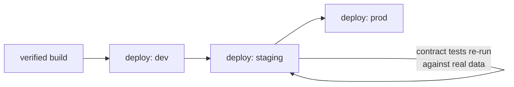
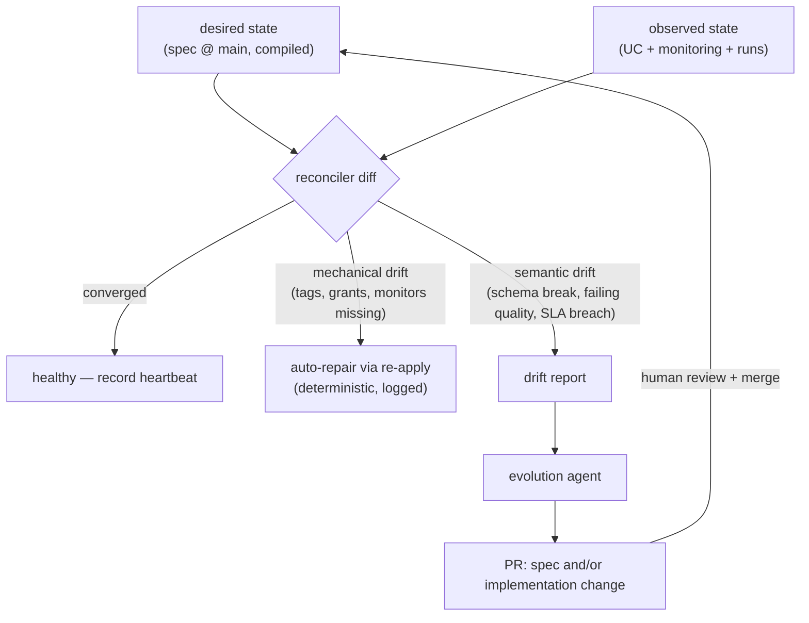

# Runtime architecture

The runtime layer is where specforge touches Databricks: deployment through Asset
Bundles, governance through Unity Catalog, observation through Lakehouse Monitoring,
and the reconciliation loop that turns "deployed once" into "converged continuously."

## Deployment

Databricks Asset Bundles are the sole deployment mechanism
([ADR-0005](../adr/0005-dab-deployment-substrate.md)). The compiler emits the bundle;
the engine runs `bundle deploy` per target environment.

Environment promotion is GitOps-shaped: merging to designated branches (or tagging)
triggers the corresponding target's apply. Contract tests re-run in each environment
— passing on scratch data in dev doesn't exempt a build from proving itself against
staging-scale reality.

**On success, the deploy step also:**

1. **Registers and tags.** Every produced UC object is tagged:
   `specforge.spec_version`, `specforge.spec_commit`, `specforge.agent`,
   `specforge.build_id`. Lineage answers "which contract version, built by which
   agent" — not just "which pipeline."
2. **Publishes the resolved spec** to a Unity Catalog Volume alongside the product
   ([ADR-0003](../adr/0003-git-authoring-uc-publishing.md)). Git is where contracts
   are *written*; UC is where they're *found*. The published copy is the compiler's
   resolved spec — what actually shipped, environment bindings included.
3. **Installs monitors** from the compiler-emitted Lakehouse Monitoring configs:
   freshness monitors from the SLA block, volume/quality monitors from the quality
   block's `monitor: true` rules.

## Observation

Two signal streams feed the reconciler:

- **Runtime health** — Lakehouse Monitoring metrics against the declared SLAs
  (freshness, volume anomalies, quality metric drift), plus pipeline run outcomes.
- **State drift** — scheduled comparison of live UC state against the compiled
  desired state: schema of the deployed table vs the contract; tags/grants vs the
  ownership block; monitor existence vs the SLA block; deployed spec version vs
  latest merged spec.

## The reconciliation loop

The Kubernetes-operator idea, adapted to GitOps-with-humans: the controller detects
divergence, but **actuation is a pull request, not an automatic mutation**.

The two drift classes get different treatment on purpose:

- **Mechanical drift** — someone hand-deleted a tag, a monitor got dropped, a grant
  is missing. The fix is exactly "re-apply the compiled artifact." No judgment
  involved → no agent involved → auto-repair, logged.
- **Semantic drift** — the world changed in a way the spec didn't anticipate. A
  source column vanished; a quality rule fails every night; freshness SLA is breached
  three days running. The *correct response* requires judgment (fix the code? change
  the contract? change the schedule?) → agent proposes, human decides, git records.

This split mirrors the compiler/generator split: determinism handles what it can;
agents handle only what needs them.

## Spec evolution and versioning semantics

Contracts version like APIs, because they are APIs:

| Change | Version bump | Downstream effect |
|---|---|---|
| Additive (new column, relaxed constraint, new doc) | minor | Non-breaking; consumers unaffected |
| Breaking (drop/rename/retype column, tightened semantics) | major | Requires a migration plan in the spec PR; old major version can be kept live in parallel during a deprecation window |
| Ops-only (schedule, compute, monitors) | patch | No contract change; redeploy only |

The compiler's plan output classifies every spec diff into one of these rows, so a
PR reviewer sees "this is a breaking change to `orders_daily` v2 → v3" before merge,
not after an angry consumer files a ticket.

## Failure and rollback

- Deploys are atomic per DAB semantics; a failed verify or deploy leaves the previous
  version live and untouched.
- Because every deployed version is pinned to a spec commit, rollback is
  `apply` of the prior commit — the same mechanism as deploy, not a special path.
- Verification failures in staging/prod produce drift reports through the same
  reconciler channel, so "the deploy gate caught it" and "monitoring caught it later"
  converge on one triage flow.
